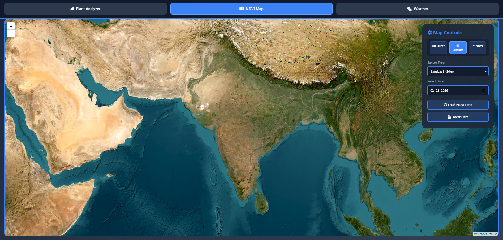
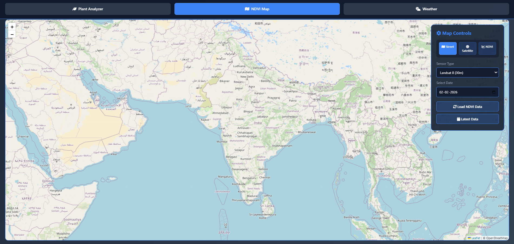
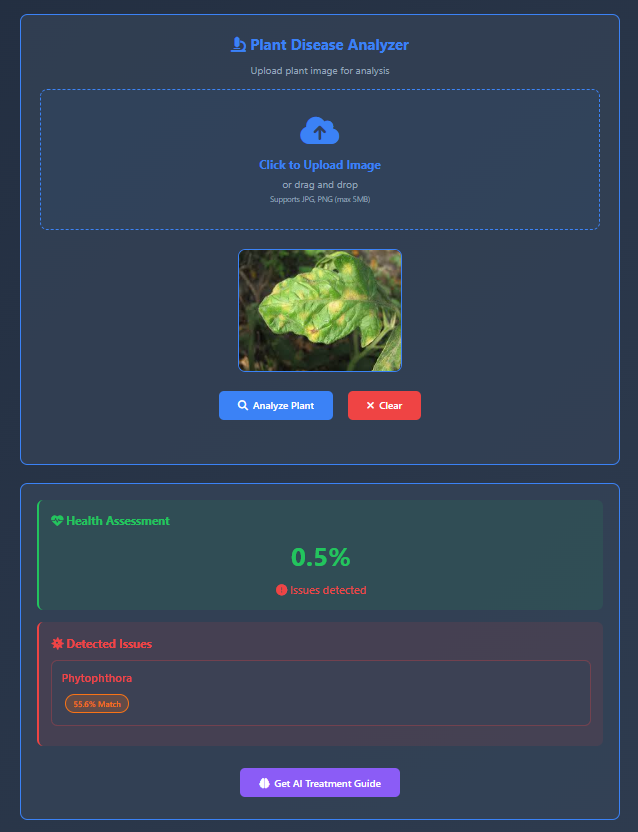
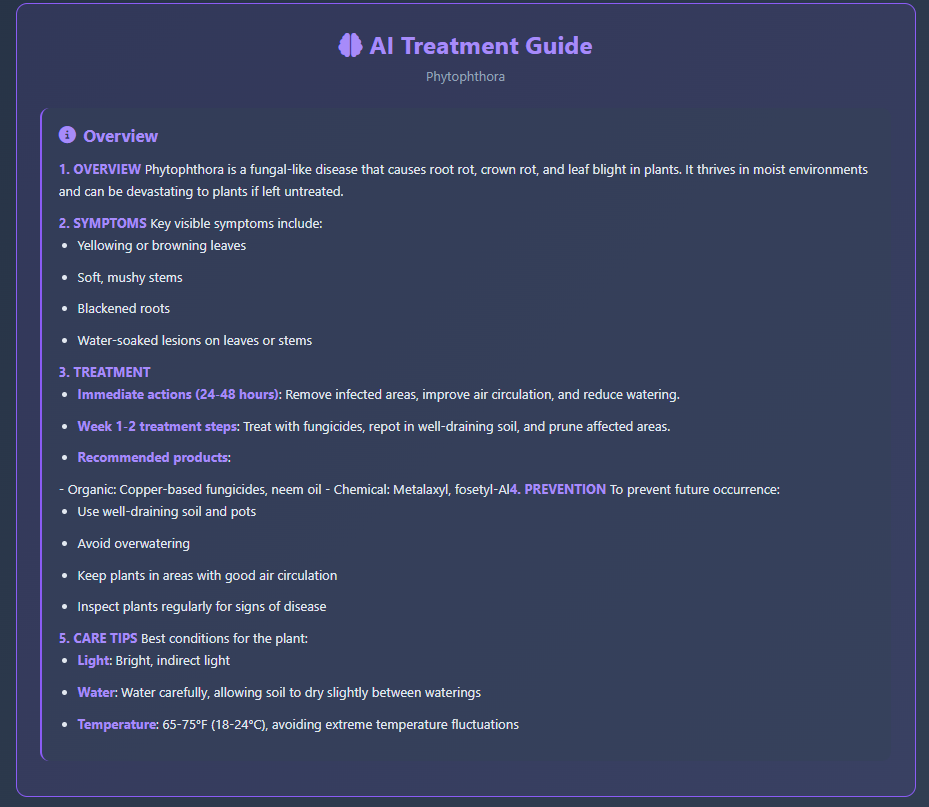
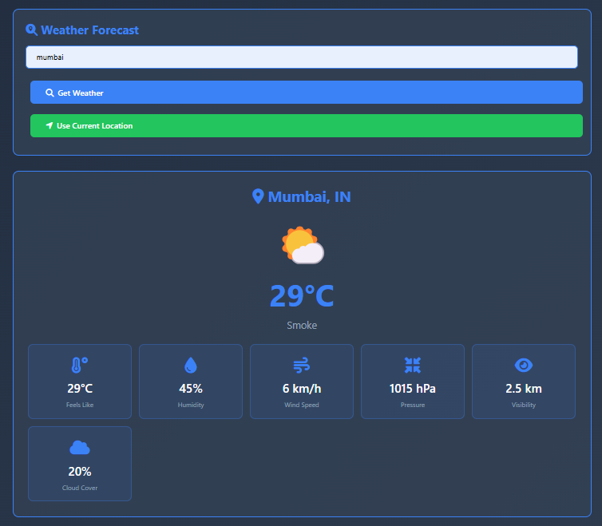

# Pflanze — AI-Powered Crop Health & Bioinformatics Platform


Pflanze (German: "plant") is an integrated precision agriculture and bioinformatics platform that combines **satellite-derived NDVI vegetation stress monitoring**, **AI-powered plant disease detection**, and a **Biopython-based pathogen genomics module** that queries NCBI for real pathogen sequences. Designed for Indian agricultural conditions and built as a research-grade tool for the intersection of remote sensing, computer vision, and computational biology.

---

## Abstract

Precision agriculture faces a critical challenge: providing smallholder farmers with timely, actionable intelligence on crop health without requiring expensive hardware or specialist expertise. Pflanze addresses this gap by fusing Sentinel-2 satellite NDVI layers, Kindwise AI disease detection with Groq LLM analysis, and Biopython-powered pathogen sequence analysis from NCBI into a single, browser-accessible application. The integrated platform enables multi-scale monitoring — from field-level vegetation stress to molecular pathogen characterization — and serves as a research prototype for the emerging field of computational precision agriculture.

---

## Key Features

### 🛰️ Satellite-Based Crop Health Monitoring (NDVI)
- Vegetation health analysis using Normalized Difference Vegetation Index (NDVI)
- Dual map visualization (standard + satellite imagery via Leaflet.js)
- Field-level identification of stressed or low-vigor crop zones
- Supports large-area monitoring without physical inspection

### 🤖 AI-Based Plant Disease Detection
- Plant species identification via Plant.ID API (Kindwise)
- Probability-ranked disease predictions with confidence scores (Crop.Health API)
- AI-generated explanations and treatment suggestions via Groq AI (Llama-3)
- Designed for early-stage symptom recognition on mobile devices

### 🌦️ Weather Monitoring and Alerts
- GPS-based hyperlocal weather data via OpenWeatherMap API
- Hourly and daily forecasts
- Severe weather alerts relevant to agricultural operations

### 🧬 Bioinformatics Module *(New)*
- Fetches real plant pathogen sequences from **NCBI Nucleotide** via Biopython Entrez API
- Computes GC content, sequence length, and full taxonomic lineage
- Correlates pathogen risk levels with satellite-derived NDVI stress zones
- Saves structured results to `data/pathogen_database.json`
- Generates a Markdown research report

---

## Technology Stack

| Component | Technology / Service | Role |
|---|---|---|
| **Frontend** | HTML5, CSS3, JavaScript | Single-page application |
| **Mapping** | Leaflet.js 1.9 | Interactive NDVI map rendering |
| **Satellite Data** | NASA GIBS, Sentinel-2 L2A, Landsat-8 | NDVI tile layers |
| **AI Disease Detection** | Plant.ID + Crop.Health APIs (Kindwise) | Plant and disease identification |
| **LLM Analysis** | Groq AI (Llama-3) | Natural language agronomic advice |
| **Weather** | OpenWeatherMap API | Hyperlocal forecasts and alerts |
| **Bioinformatics** | **Biopython 1.81**, NCBI Entrez API | Pathogen sequence fetch and analysis |
| **Sequence Database** | NCBI Nucleotide | Plant pathogen reference genomes |
| **Citizen Science** | iNaturalist | Supplementary species observation data |
| **Python Runtime** | Python 3.9+, NumPy, Requests | Data processing |

---

## Bioinformatics Module

### Overview

The `notebooks/pathogen_analysis.py` script links app-detected diseases to their causative agents at the molecular level:

```python
from Bio import Entrez, SeqIO
from Bio.SeqUtils import gc_fraction

# Pathogens mapped to diseases covered in the Pflanze app
PATHOGEN_SEQUENCES = {
    "Tobacco Mosaic Virus": {"id": "NC_001497", "crop": "Tomato/Tobacco"},
    "Rice Blast Fungus":    {"id": "NC_017850", "crop": "Rice"},
    "Potato Late Blight":   {"id": "NC_015247", "crop": "Potato/Tomato"},
    "Wheat Stripe Rust":    {"id": "NC_014069", "crop": "Wheat"},
}

# NDVI formula (Rouse et al. 1974)
def compute_ndvi(nir, red):
    return (nir - red) / (nir + red)
```

### How to Run

```bash
# 1. Install dependencies
pip install -r notebooks/requirements.txt

# 2. Run the analysis
python notebooks/pathogen_analysis.py

# Output:
#   data/pathogen_database.json   — structured pathogen database
#   notebooks/research_summary.md — Markdown research report
```

---

## Datasets

| Dataset | Source | Use in Pflanze | Citation |
|---|---|---|---|
| PlantVillage | Penn State / Kaggle | Disease category reference | Hughes & Salathé (2015) |
| NCBI Nucleotide | NCBI / NIH | Pathogen genome sequences | NCBI (2024) |
| Sentinel-2 L2A | ESA Copernicus | NDVI computation | ESA (2015) |
| Landsat-8 OLI | USGS / NASA | Supplementary multispectral | USGS (2013) |
| OpenWeatherMap | OpenWeather Ltd. | Weather forecasts and alerts | — |
| iNaturalist | iNaturalist.org | Species observations | — |

---

## System Architecture

```
┌─────────────────────────────────────────────────────────────┐
│                   PFLANZE PLATFORM OVERVIEW                  │
└──────────────────┬───────────────────────┬──────────────────┘
                   │                       │
      ┌────────────▼────────┐   ┌──────────▼──────────────┐
      │  WEB APP (index.html│   │  BIOINFORMATICS MODULE   │
      │  Browser / Mobile)  │   │  (notebooks/             │
      │                     │   │   pathogen_analysis.py)  │
      │  • NDVI Map Layer   │   │                          │
      │  • Disease Detection│   │  • NCBI Entrez fetch     │
      │  • Weather Alerts   │   │  • GC content analysis   │
      └────────┬────────────┘   │  • Taxonomy extraction   │
               │                │  • NDVI correlation      │
    ┌──────────▼──────────────────────────▼──────────┐
    │              EXTERNAL DATA SOURCES              │
    │  Sentinel-2 │ NCBI │ Plant.ID │ Groq │ Weather  │
    └─────────────────────────────────────────────────┘
```

---

## Quick Start

### Open the Web App

```bash
# Clone the repository
git clone https://github.com/yashraj221/Pflanze_app_V1.git
cd Pflanze_app_V1

# Open the app in your browser (no server required)
open index.html
# or on Linux:
xdg-open index.html
```

### Run the Bioinformatics Module

```bash
# Install Python dependencies
pip install -r notebooks/requirements.txt

# Run pathogen sequence analysis
python notebooks/pathogen_analysis.py
```

---

## Research Documentation

| Document | Description |
|---|---|
| [`docs/research_report.md`](docs/research_report.md) | Full research report: methodology, datasets, results, references |
| [`docs/bioinformatics_pipeline.md`](docs/bioinformatics_pipeline.md) | Detailed pipeline documentation with ASCII architecture diagrams |
| [`data/sample_pathogen_database.json`](data/sample_pathogen_database.json) | Pre-filled pathogen database (no NCBI call required) |
| [`CITATION.cff`](CITATION.cff) | Citation file for academic use |

---

## Screenshots

| NDVI Satellite View | NDVI Street View |
|---|---|
|  |  |

| AI Disease Detection | AI Summary |
|---|---|
|  |  |

| Weather View |
|---|
|  |

---

## Contributing

Contributions are welcome! To propose a new research feature, please use the [Research Feature Request](.github/ISSUE_TEMPLATE/research_feature.md) issue template.

1. Fork the repository
2. Create a feature branch (`git checkout -b feature/my-research-feature`)
3. Commit your changes
4. Open a Pull Request with a clear description of your contribution

---

## Citation

If you use Pflanze in your research, please cite it using the [`CITATION.cff`](CITATION.cff) file, or use:

```bibtex
@software{pflanze2026,
  author    = {Yashraj},
  title     = {Pflanze: AI-Powered Crop Health \& Bioinformatics Platform},
  year      = {2026},
  version   = {1.0.0},
  url       = {https://github.com/yashraj221/Pflanze_app_V1},
  license   = {MIT}
}
```

---

## License

This project is licensed under the [MIT License](LICENSE).

---
